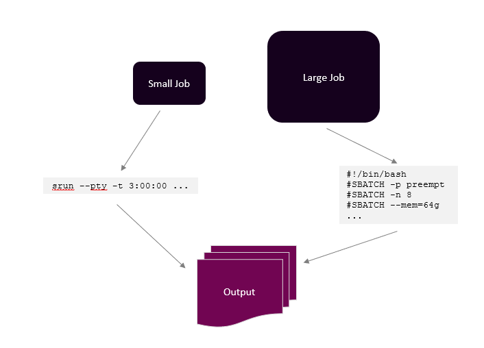

30 minutes

## Log into the HPC cluster’s On Demand Interface

- Open a Chrome browser and go to [On Demand](https://ondemand.pax.tufts.edu/)
- Log in with your Tufts Credentials
- On the top menu bar choose `Clusters->Tufts HPC Shell Access`


- You'll see a welcome message and a bash prompt, for example for user `tutln01`:

|`[tutln01@login001 ~]$`|
|-|

This indicates you are logged in to the login node of the cluster.

## How Should We Run AlphaFold2?

Now that we are at a login node we need to get to a compute node to get our job done. For shorter jobs we can get an interactive session like so:

|DO NOT RUN|
|--|
|`srun --pty -t 3:00:00 --mem 16G -N 1 --cpus 4 bash`|

Where:

|`command`|description|
|-|-|
|`srun`|SLURM command to run a parallel job|
|`--pty`| get a pseudo terminal|
|`-t` | time we need here we request 3 hours|
|`--mem` | memory we need here we request 16 Gigabytes|
|`-N` | number of nodes needed here we requested 1 node|
|`--cpus` | number of CPUs needed here we requested 4|

However, a program like AlphaFold might take much longer and require more memory than we can request in an interactive session like this. So to run our job we will need to write a batch script. A batch script will allow us to submit our job to a queue to be run on a compute node. The following graphic shows which solution is the best fit given the size of the job:



## Prepare the Batch Script

A batch script can be broken into two parts - the header section with information on how to run the job and a command section where we use UNIX commnads to do a job. Here is our header section:

```
#!/bin/bash
#SBATCH -p ccgpu  
#SBATCH -n 8   
#SBATCH --mem=64g 
#SBATCH --time=2-0      
#SBATCH -o output.%j 
#SBATCH -e error.%j   
#SBATCH -N 1   
#SBATCH --gres=gpu:1  
#SBATCH --exclude=c1cmp[025-026] 
```
The `#SBATCH` commands above do the following:

|`command`|description|
|-|-|
|`#!/bin/bash`|specify our script is a bash script|
|`#SBATCH -p ccgpu`| The partition we are requesting, and if you don't have ccgpu access, use "preempt"|
|`#SBATCH -n 8` | The number of cpu cores we would like - here it is 8|
|`#SBATCH --mem=64g ` |The amount of RAM we would like - here it is 64 Gigabytes|
|`#SBATCH --time=2-0` | The time we think our job will take - here we say 2 days (days-hours:minutes:seconds)|
|`#SBATCH -o output.%j` |The name of the output file - here it is "output.jobID"|
|`#SBATCH -N 1`|The number of nodes we would like - here it is 1|
|`#SBATCH --gres=gpu:1 `|The number of GPUs - here we ask for 1|
|`#SBATCH --exclude=c1cmp[025-026]`|These are nodes to exclude when using AlphaFold2|

Now that we have a header section we can specify our commnands to run AlphaFold2:

```
# Load the AlphaFold2 and NVIDIA modules
module load alphafold/2.1.1
nvidia-smi

# Make the results direcory
mkdir /path/to/your/home/directory/af2

# Specify where your output directory and raw data are
outputpath=/path/to/your/home/directory/af2
fastapath=/path/to/your/home/directory/data/1AXC.fasta

# Date to specify if you want to avoid using template
maxtemplatedate=2020-06-10

source activate alphafold2.1.1

# Running alphafold 2.1.1
runaf2 -o $outputpath -f $fastapath -t $maxtemplatedate -m multimer 
```
In the command section we first load our `alphafold/2.1.1` and `nvidia-smi` modules. We then make an output directory for our alphafold results. Next we specify where we want our results to be stored and where our fasta file input is. The `maxtemplatedate` option is a bit more complicated. If we ask AlphaFold to predict the structure of a protein with a structure **already** in the [Protein Data Bank (PDB)](https://www.rcsb.org/) - then we have the option of using that structure in the prediction. If we do not want AlphaFold 2 to use this structure in the prediction we need to specify a date **before** the release date of that structure. After specifying a release date we activate the alphafold conda environment with `source activate alphafold2.1.1`. Now that we have an activated environment we can run the alplhafold command runaf2 with our specifications.  You'll note the output file path, input fasta file path, and max template date are noted. If you are trying to predict a multimeric protein, specify this with the `-m multimer` option.

Putting this all together your overall batch script will look like this:

```
#!/bin/bash
#SBATCH -p ccgpu  
#SBATCH -n 8   
#SBATCH --mem=64g 
#SBATCH --time=2-0      
#SBATCH -o output.%j 
#SBATCH -e error.%j   
#SBATCH -N 1   
#SBATCH --gres=gpu:1  
#SBATCH --exclude=c1cmp[025-026] 
# Load the AlphaFold2 and NVIDIA modules
module load alphafold/2.1.1
nvidia-smi

# Make the results direcory
mkdir /path/to/your/home/directory/af2

# Specify where your output directory and raw data are
outputpath=/path/to/your/home/directory/af2
fastapath=/path/to/your/home/directory/data/1AXC.fasta

# Date to specify if you want to avoid using template
maxtemplatedate=2020-06-10

source activate alphafold2.1.1

# Running alphafold 2.1.1
runaf2 -o $outputpath -f $fastapath -t $maxtemplatedate -m multimer 
```

For the purposes of this workshop we will **NOT** be submitting this batch script. However, outside of this workshop, if you'd like to submit a batch job you'd simply save the script above (e.g. runaf2.sh). You'll just need to be sure that the script ends in ".sh" to signify it is a bash script. To submit the script on the Tufts HPC cluster you'll enter the command `sbatch runaf2.sh`. Again, for the purposes of this exercise we will not be submitting this script. 

_________________________________________________________________________________________________________________________________________________________________________________

Next Lesson: [AlphaFold2 Output](../lesson3/lesson3.md)

Previous: [Introduction to AlphaFold2](../lesson1/AlphaFold2_Tutorial.pdf)
