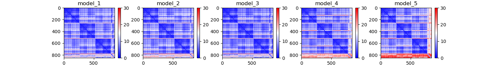
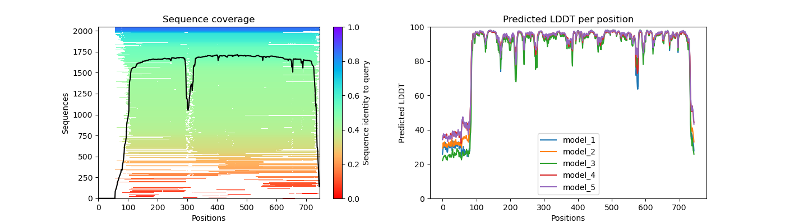

## AlphaFold Output

 - Here we predicted the structures of PCNA and LIG1. Let's examine the output by navigating to the PCNA output folder:
 
 ```
 cd af2Workshop/pcna/1AXC/
 ls 
 ```
 - You should see output that looks like the following:
 
 ```
  [tutln01@c1cmp048 1AXC]$ ls
features.pkl  ranked_1.pdb  ranked_4.pdb                  relaxed_model_2_multimer.pdb  relaxed_model_5_multimer.pdb  result_model_3_multimer.pkl  timings.json                    unrelaxed_model_3_multimer.pdb
msas          ranked_2.pdb  ranking_debug.json            relaxed_model_3_multimer.pdb  result_model_1_multimer.pkl   result_model_4_multimer.pkl  unrelaxed_model_1_multimer.pdb  unrelaxed_model_4_multimer.pdb
ranked_0.pdb  ranked_3.pdb  relaxed_model_1_multimer.pdb  relaxed_model_4_multimer.pdb  result_model_2_multimer.pkl   result_model_5_multimer.pkl  unrelaxed_model_2_multimer.pdb  unrelaxed_model_5_multimer.pdb
 ```
 
 - Where:
 
|File/Directory|Description|
|-|-|
|features.pkl|A pickle file w/ input feature NumPy arrays|
|msas|A directory containing the files describing the various genetic tool hits that were used to construct the input MSA.|
|unrelaxed_model_\*.pdb|A PDB file w/ predicted structure, exactly as outputted by the model|
|relaxed_model_\*.pdb|A PDB file w/ predicted structure, after performing an Amber relaxation procedure on the unrelaxed structure prediction|
|ranked_\*.pdb |A PDB file w/ relaxed predicted structures, after reordering by model confidence (using predicted LDDT (pLDDT) scores). ranked_1.pdb = highest confidence ranked_5.pdb = lowest confidence|
|ranking_debug.json|A JSON file w/pLDDT values used to perform the model ranking, and a mapping back to the original model names.|
|timings.json|A JSON file w/times taken to run each section of the AlphaFold pipeline.|
|result_model_\*.pkl| A pickle file w/ a nested dictionary of the various NumPy arrays directly produced by the model: StructureModule Output, Distograms, Per-residue pLDDT scores, predicted TMscore, predicted pairwise aligned errors |

## Plotting Structure Prediction Information

- We can leverage the `pkl` files to gain insight into our structure predictions. To do so we use a python script provided by the [VIB Bioinformatics Core](https://elearning.bits.vib.be/courses/alphafold/lessons/alphafold-on-the-hpc/topic/alphafold-outputs/) which we call `vizaf2.py`. First we will need to move back up one directory and load the AlphaFold module so that we have the packages needed to run our script.

```
cd ../../
```
```
[tutln01@c1cmp048 1AXC]$ ls
data  lig1  lig1af2.sh  pcna  pcnaaf2.sh  plotaf2.ipynb  vizaf2.py
```
```
module load alphafold/2.1.1
```

- Now we will need to feed our script three arguments:
 - `--input_dir` input directory with model files mentioned above
 - `--output_dir` output directory to put our plots of model information
 - `--name` optional prefix to add to our file names

```
python vizaf2.py --input_dir pcna/1AXC/ --output_dir pcna/visuals/ --name pcna
```

- Running this will generate two images in your output directory:
 - `pcna_coverage_LDDT.png` - plots of your msa coverage and pLDDT scores per residue per model
 - `pcna_PAE.png` - plots of your predicted alignment error for each of your models

### pcna_coverage_LDDT.png


### pcna_PAE.png



- Now that we have these plots for the PCNA structure prediction, let's run this on the LIG1 prediction as well!

```
python vizaf2.py --input_dir lig1/1X9N/ --output_dir lig1/visuals/ --name lig1
```
### lig1_coverage_LDDT.png



### lig1_PAE.png


<details>
<summary><b>Question 2: Given the MSA plots above, which protein seems to have more consistent coverage? </b></summary>
<br>
 PCNA seems to have the most consistent coverage throughout all residues
</details>

<details>
<summary><b>Question 3: For the protein that has the least consistent coverage, discuss why that might be and what domain on that protein is poorly covered? </b></summary>
<br>
 LIG1 has the lease consistent coverage and it appears that the PCNA binding domain has the lease consistent coverage.
</details>

<details>
<summary><b>Question 4: The PAE plots, or predicted alignment error, show the expected distance error when one residue is aligned to another. Explain each protein's PAE plots. Do you see any patterns or areas of high area? Why might that be?</b></summary>
<br>
 The PAE plot for PCNA show three distinct areas of low alignment error which indicate. These dark patches are most likely caused by the fact that this is a multimer. The residues within the each monomer align better than the residues between monomers. As for LIG1, we see a consitent low error region and a series of residues with high error. This high error region appears to be the PCNA binding domain which had poor representation in the MSA plot.
</details>

________________________________________________________________________________________________________________________________________________________

Next: [PyMOL Visualization](../lesson4/lesson4.md)

Previous: [Setup](../lesson2/lesson2.md)

[Main Page](../../README.md)
