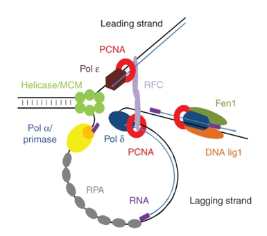

30 minutes

## Proliferating Cell Nuclear Antigen (PNCA)

In the previous lesson we demonstrated how to put together a batch script to run the alphafold program. However, since it can take quite a bit of time to run we will be working with output from an AlphaFold 2 prediction. But first let's get acquainted with the protein we will be working with today, Proliferating Cell Nuclear Antigen (PNCA). PNCA is a very well conserved protein across eukaryotes and even Archea. It acts as a processivity factor of DNA Polymerase delta, necessary for DNA replication:

Aside from DNA replication PNCA is involved in:

* chromatin remodelling 
    
* DNA repair
    
* sister-chromatid cohesion

* cell cycle control

It should also be noted that PNCA is a multimeric protein consisting of three monomers. We will now determine how well AlphaFold did at predicting it's structure. 
_________________________________________________________________________________________________________________________________________________________________________________

Next Lesson: [AlphaFold2 Output](../lesson4/lesson4.md)

Previous: [Introduction to AlphaFold2](../lesson2/lesson2.md)

_________________________________________________________________________________________________________________________________________________________________________________

## References

1. [Proliferating cell nuclear antigen (PCNA): a key factor in DNA replication and cell cycle regulation](https://www.ncbi.nlm.nih.gov/pmc/articles/PMC3091797/#:~:text=Proliferating%20cell%20nuclear%20antigen%20(PCNA)%20is%20an%20evolutionarily%20well%2D,as%20well%20as%20in%20Archaea.&text=This%20protein%20was%20identified%20over,et%20al.%2C%201978).)
2. [Functional identity of proliferating cell nuclear antigen and a DNA polymerase-δ auxiliary protein](https://www.nature.com/articles/326517a0)
3. [Proliferating cell nuclear antigen (PCNA): a dancer with many partners](https://journals.biologists.com/jcs/article/116/15/3051/27162/Proliferating-cell-nuclear-antigen-PCNA-a-dancer)

