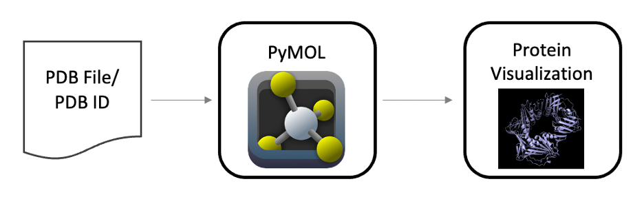
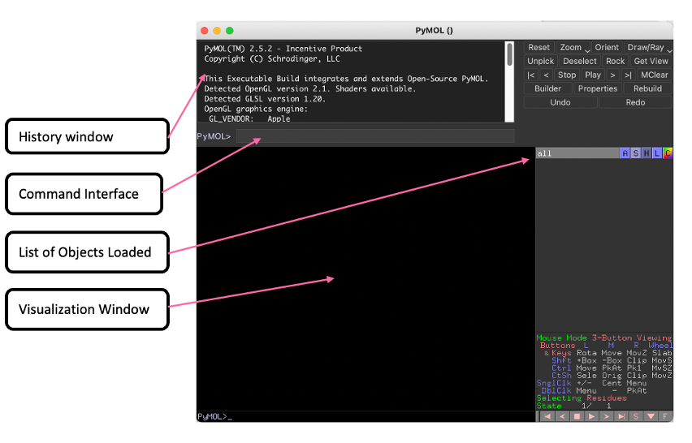
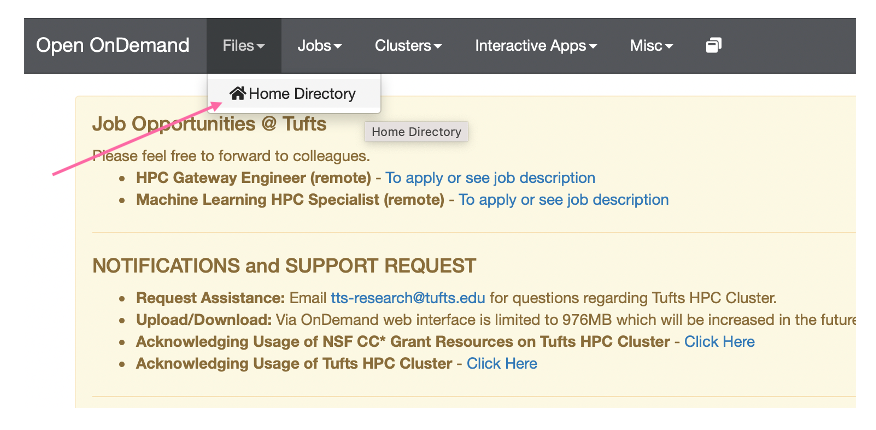
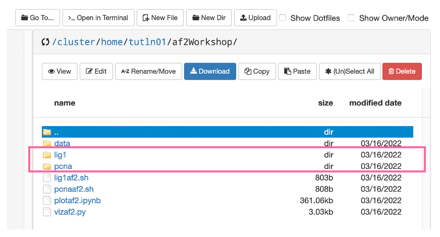
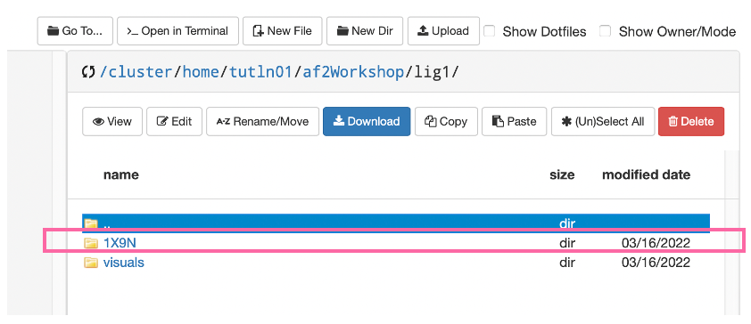
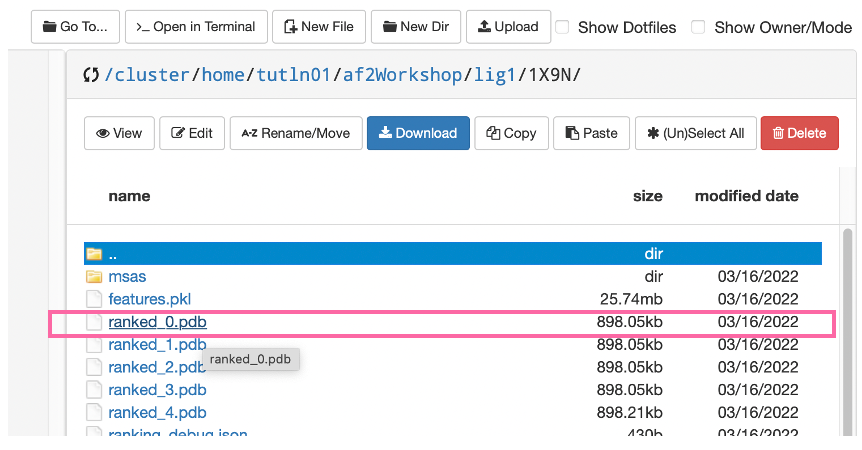
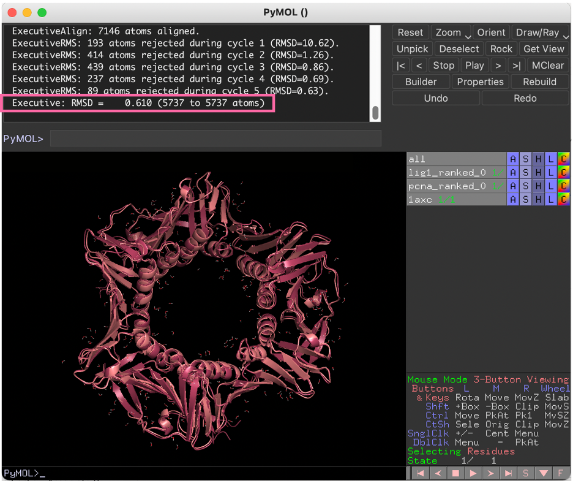

## Visualizing With Pymol

- In the previous slide we plotted our MSA alignment, the pLDDT scores, and the predicted alignement error. However, it is also useful to visualize the actual predicted protein structure and compare it to the known structure if there is one. Here we use a software called PyMOL to do just that:



- Here we see that PyMOL takes either the PDB ID or a PDB file and creates a vizualization for us to examine. If you have not done so already please [download PyMOL](https://pymol.org/2/) and open the app. You should see a window like the follwing:



- Here we have a:
  - **History Window** with log of previous commands
  - **Command Interface** to enter PyMOL commands
  - **List of Objects Loaded** which list of objects/proteins that have been loaded into PyMOL
  - **Visualization Window** to visualize protiens loaded into PyMOL

- Let's try on our data!

## Download AlphaFold Output

- First we will need to download our predicted structure pdb files. To this go to Files > Home Directory:



- Then navigate to your AlphaFold Workshop directory, where you will note the two folders we examined earlier that have our AlphaFold Outputs:



- In each folder you will note a `visuals` folder and an ID number. Navigate to the ID number folder and download the file "ranked_0.pdb" - this structure is AlphaFold's best prediction of the protein's structure.




- Make sure to add a prefix to each `ranked_0.pdb` file as to not confuse the two. You can rename the `ranked_0.pdb` in the `lig1` folder to `lig1_ranked_0.pdb` and the `ranked_0.pdb` in the `pcna` folder to `pcna_ranked_0.pdb`. 

## AlphaFold Output In PyMOL

- To visualize these protein structures in PyMOL go to File > Open - then choose your pdb files. 
- Loading two objects can make it difficult to see examine both individually, so enter the following command to hide lig1:

```
disable lig1_ranked_0
```
- Now you should only see `pnca_ranked_0`. It would be interesting to see how well this prediction lines up with the know structure for PCNA. We can load that structure with the following command

```
fetch 1axc
```
- To see how well our predicted structure lines up we can compare the two by aligning them:

```
align pcna_ranked_0, 1axc
```



- In the history window you'll note that when we aligned our structures we were given an RMSD or root mean square deviation value. The smaller this value is, the better our two structures have aligned. 
- Now that we have aligned the predicted PCNA structure, repeat these steps to align LIG1 (the PDB ID for LIG1 id `1x9n`).

<details>
<summary><b>Question 5: Which protein had the lowest RMSD score and why? </b></summary>
<br>
 LIG1 had the highest RMSD score, likely caused by the area of low conservation in the MSA. Given how well PCNA was conserved it makes sense that it had the best alignment to its original structure.
</details>

<details>
<summary><b>Question 6: Were your initial assumptions about the AlphaFold 2 prediction correct? What does this tell you about which proteins are likely to have the best prediction? </b></summary>
<br>
 Yes, given that LIG1 had more disordered regions it appears to have had a poorer structure prediction. AlphaFold 2 appears to work well for conserved proteins without disordered regions. 
</details>

_________________________________________________________________________________________________________________________________________________________

Next (Optional): [Writing An AlphaFold Batch Script](../lesson5/lesson5.md)

Previous: [AlphaFold Output](../lesson3/lesson3.md)

[Main Page](../../README.md)
